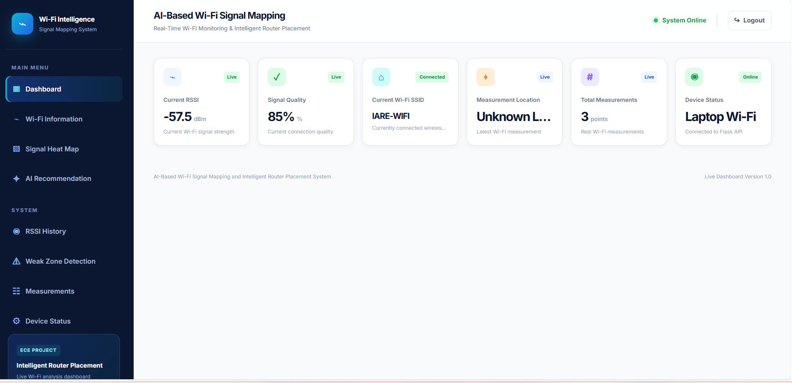
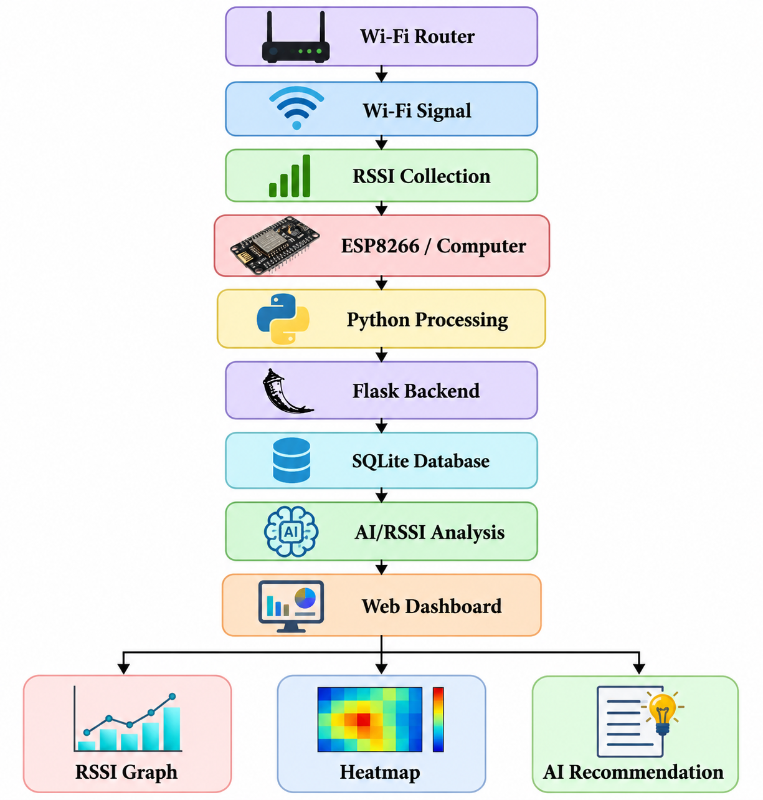
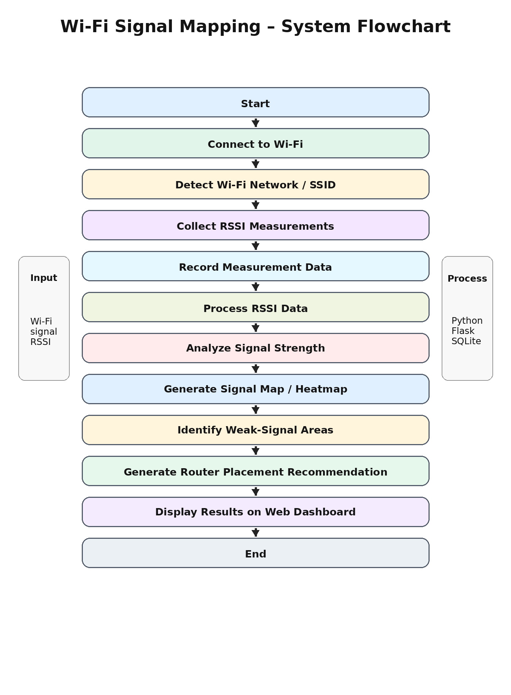
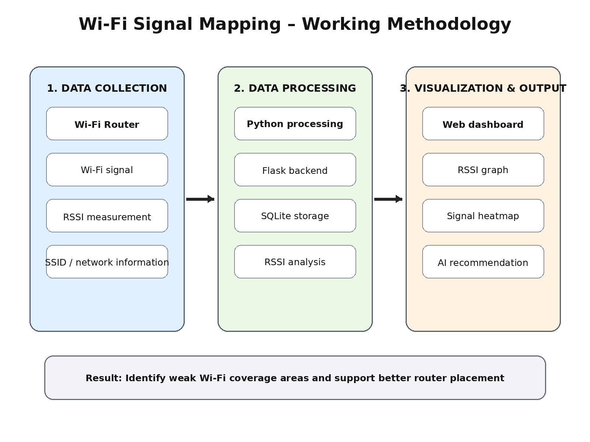

# AI-Based Wi-Fi Signal Mapping and Intelligent Router Placement Using RSSI Analysis

## 📌 Project Overview

This project presents an AI-based Wi-Fi signal mapping system that analyzes Wi-Fi signal strength using RSSI (Received Signal Strength Indicator) values.

The system collects Wi-Fi signal information and displays it through a web-based dashboard. It helps identify weak-signal areas and provides intelligent recommendations for improving router placement.

## 🎯 Objectives

- Measure Wi-Fi signal strength using RSSI values.
- Visualize Wi-Fi signal conditions through a web dashboard.
- Identify weak-signal and dead-zone areas.
- Monitor Wi-Fi signal variations.
- Provide router placement recommendations.
- Store and analyze Wi-Fi measurement data.

## ✨ Key Features

- 📶 Wi-Fi RSSI monitoring
- 📊 Signal strength visualization
- 🗺️ Wi-Fi signal mapping
- 🔴 Weak-signal area identification
- 🤖 Intelligent router placement recommendation
- 🌐 Flask-based web dashboard
- 📡 Automatic Wi-Fi measurement
- 💾 Local data storage using SQLite

## 🖥️ Project Screenshots

### Wi-Fi Signal Mapping Dashboard

The dashboard provides real-time visualization of Wi-Fi signal information, RSSI values, graphs, heatmap information, and recommendations.



### System Architecture

The system architecture shows the flow from Wi-Fi signal collection through processing, storage, analysis, and dashboard visualization.



### System Flowchart

The flowchart represents the complete sequence of operations performed by the Wi-Fi signal mapping system.



### Working Methodology

The working methodology illustrates the three major stages: data collection, data processing, and visualization/output.



## 🧩 System Components

### Hardware

- ESP8266 / NodeMCU
- Wi-Fi-enabled computer/device
- Wi-Fi router

### Software

- Python
- Flask
- HTML
- CSS
- JavaScript
- SQLite
- Chart.js

## ⚙️ System Architecture

```text
Wi-Fi Signal
     ↓
RSSI Data Collection
     ↓
ESP8266 / Computer
     ↓
Python Processing
     ↓
Flask Backend
     ↓
Data Analysis
     ↓
Web Dashboard
     ↓
Signal Mapping
     ↓
Router Placement Recommendation
